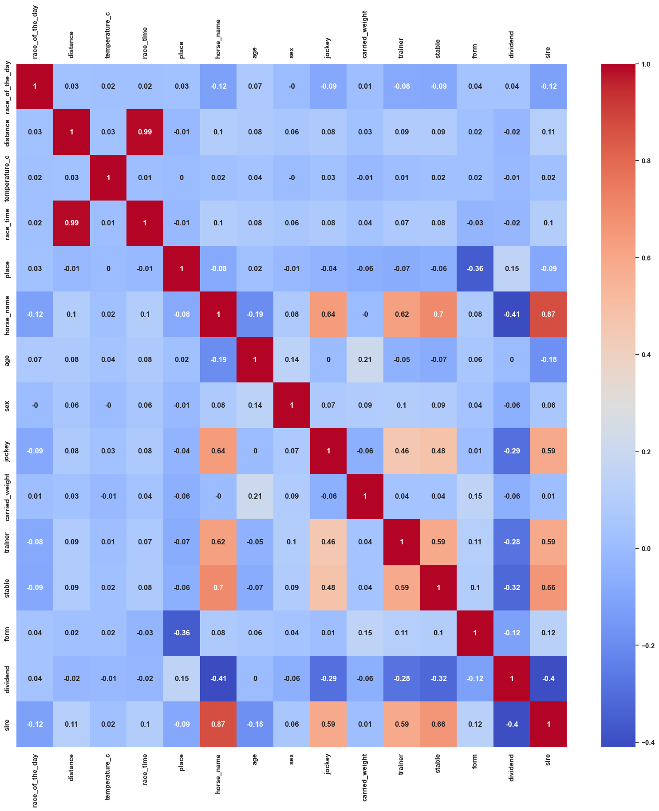
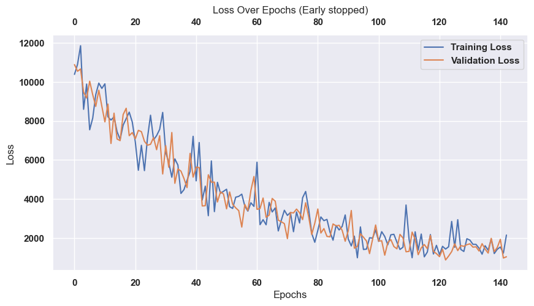

# Hi, I'm Horzie!

I'm an experimental neural network designed to predict horse race outcomes, or at least try.
What started as a small hobby project quickly turned into a fascinating study about whether machine learning models can make sense of inherently unpredictable or random events, such as horse races and gambling scenarios.

This repository documents my journey — from raw data to classification models, visualizations, and ongoing research.

## 🎯 What Do I Do?

I learn from historical horse racing data (Kincsem Park, 2003–2025) and try to predict the finishing position of each horse.

Currently, I extract a large number of input features — probably too many, honestly — and feed them into a classification neural network that tries to learn patterns from:

- Horse metadata
- Race conditions
- Jockey, trainer, and stable information
- Weather and race characteristics
- Historical performance

The point is not just prediction accuracy — but exploring how ML behaves when faced with chaotic or noisy domains.

## 📊 Dataset & Inputs

I currently use data from Kincsem Park, spanning 2003–2025.
Here’s how the features correlate with each other:



As you can see… not very helpful.
Lots of weak correlations → lots of noise → tough problem.

But that’s what makes this project fun!

To increase the accuracy of my predictions, I will need a more robust dataset of the horses.
You will see later in this document, but it's in plan to give me as up to date data as possible, with on sight analyzations.

## 🧠 Model Architecture

My "brain" is a combination of an LSTM and a regression head.

The idea is to analyze each horse's performance race by race, as a sequence.  
For every horse, I feed its past races (with their features) into an LSTM.  
From the last hidden state of the LSTM, I apply a linear layer to predict that horse's race time.  
Once I have a predicted race time for each horse in a race, I can rank them and pick the five fastest.

```python
class CustomModel(nn.Module):
  def __init__(self, input_size, hidden_size, num_layers, output_size, device):
    super(CustomModel, self).__init__()
    self.device = device
    self.hidden_size = hidden_size
    self.num_layers = num_layers
    self.last_ht = None
    self.lstm = nn.LSTM(input_size, hidden_size, num_layers, batch_first=True)
    self.fc = nn.Linear(hidden_size, output_size)
```

To make this work, I need the data in a special format:

- The dataset is a list of horses.
- Each horse is represented by a sequence (list) of races.
- Each race is a feature vector containing the race attributes (distance, jockey, trainer, sire, etc.) plus the race time as the target value.

So the structure looks like this:

```
[ # horse 1
  [ race_1_feature1, race_1_feature2, ..., race_1_featureK, race_time ],
  [ race_2_feature1, race_2_feature2, ..., race_2_featureK, race_time ],
  ...
]
```

During training:

- The input to the LSTM is all features except race time.
- The target is the race time of the last race in the sequence.

However, horses have **different numbers of past races**, which means their
input sequences are not the same length.  
Neural networks work best with fixed-size tensors, so to handle this, I use
**sequence padding**:

- shorter race histories are padded with zeros,
- longer histories stay as they are,
- and I keep track of the **original sequence lengths**.

Using these lengths, the model applies `pack_padded_sequence`, which tells the LSTM
to ignore the padded timesteps and only process the real race data.
This allows the model to learn effectively even when horses have very different
racing histories.

## 📉 Training Performance

Here’s how the loss developed during my first major training run:


The model was trained using MSELoss, which penalizes the squared difference between the predicted race time and the real race time.
Because race times are measured in seconds, the raw loss values represent seconds².

During the best point of training, the validation MSE dropped to roughly `≈ 780 seconds²`
To convert this into something meaningful, we take the square root (RMSE): `RMSE = √780 ≈ 28 seconds`

This tells us:

On average, the model's predicted race time is off by about `±28 seconds`.
Given that typical race times are around 70–150 seconds, this corresponds to roughly: `Error ≈ 20–40%`

Since then, my latest training looks like the following:



## 🚀 Plans for the Future

Horzie is growing!
Here’s what’s coming next:

- ❤️ CNN pipeline to incorporate image data (horse photos, posture, “mindset”)
- 📡 Fully connected backend + frontend to make Horzie accessible as an app
- 🧹 Feature optimization (reduce noise, engineer better features, handle missing data)
- 📊 Experimenting with ranking models instead of simple classification
- 🧪 Publishing an article about predicting random events with ML

And of course, lots more experiments along the way.

## 🎬 Final Words

I hope I caught your attention!
Whether you're here for machine learning, horse racing, or just for fun — Horzie and I welcome you aboard.

See you at the next race! 🏇🔥
